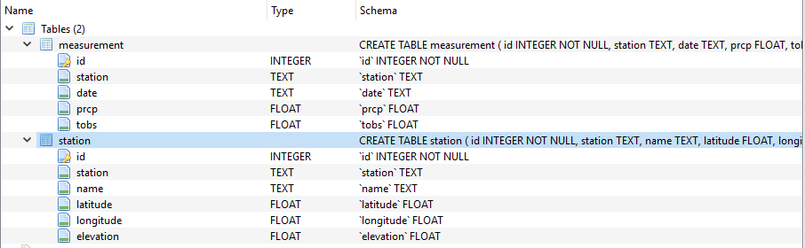

# Weather Guide for a Vacation
It is important to plan trip activities based on climate, don’t want to be on a beach when raining. Analysis considers temperatures, precipitation and observed stations for the City of Honolulu, Hawaii. Along with the analysis, you can also leverage Flask API to receive JSON response. The end points for the API are listed below.
 
API Specs

- End point is /api/v1.0/precipitation --- The  end point returns JSON response listing all the temperatures grouped by date in the data set.

- End point is /api/v1.0/stations --- Stations Analyzed – The end point returns JSON response listing all the stations from the data set. 

- End point is /api/v1.0/tobs --- The end point returns JSON response for the historical temperatures observed in the past year.

- End point for Start Date is /api/v1.0/<start>
- End point for both Start and End Date is /api/v1.0/<start>/<end>
Temperature Ranges – For a given date range, it returns Minimum, Average and Maximum temperature. Date Range can be specified with either start date, in which case end Date is the last observation in the data set. If an End date is mentioned, then the statistics are calculated for dates within Start and End Dates.
    
### Schema of the data used for the Analysis is :

